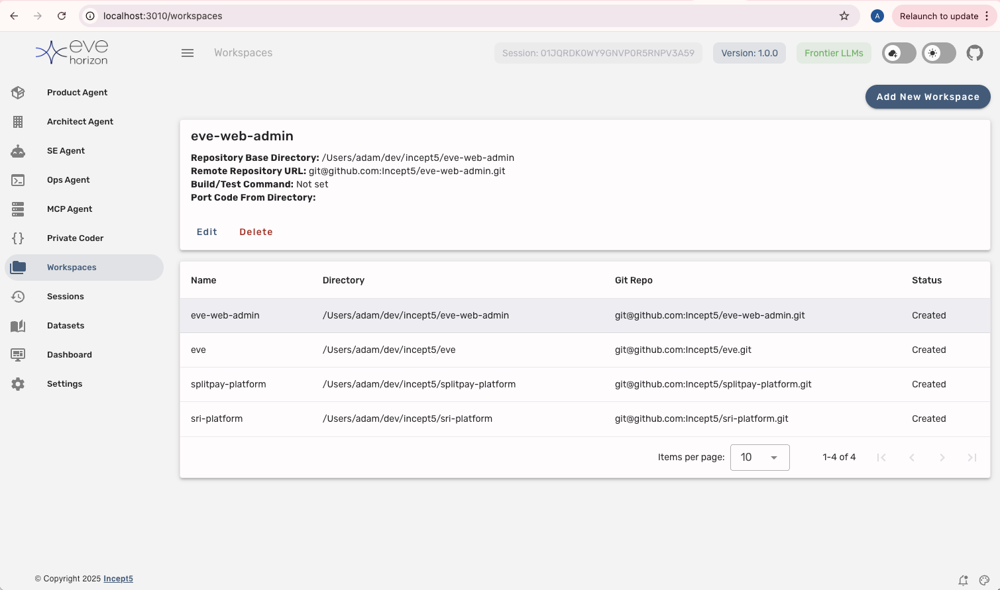
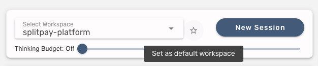

<div style="display: flex; justify-content: space-between; align-items: center; width: 100%;">
  
  
</div>
<h1 align="center">Eve</h1>

<p align='center'>
<b>Take command of your own set of Software Engineering Agents</b><br><br>
</p>

## Summary

Eve is a powerful tool that allows you to develop software at a higher level using natural language.

Key Features:
* Node-based server with an easy-to-use web UI
* Supports Anthropic Claude Opus/Sonnet 4.5 (plus Google Gemini, OpenAI, Groq, GLHF, Mistral & Ollama for local LLMs)
* Works with existing codebases or a clean slate
* **Four Specialized Agent Personas** - each tuned for different tasks
* **Toggleable Rules** - enable workflow behaviors like TDD, auto-commit, memory bank, etc.
* Workspace management for multiple projects
* Git integration for version control
* Simplified "In-Repo" Epics/Stories/Task project management
* MCP server support for extending agent capabilities

## Quick Start

1. Clone the repository
2. Verify and install required tools (Node.js 20+ and pnpm)
3. Run the Eve server with `./eve.sh`
4. Access the web UI in your browser at http://localhost:3010
5. Go to the Settings page (bottom link on left hand menu) and enter the required API keys:
6. Get your free Eve API Key from here: https://incept5.github.io/eve-web-admin
7. Enter the API key into Settings page to activate Eve
8. Get a Claude API Key from https://console.anthropic.com
9. On the models tab put your Claude API key into the Anthropic API edit and save to activate Claude
10. Go to the Workspaces page (from left side menu) and import your local git repo as a workspace
11. Chat with the Agents to make updates to your system

For detailed instructions, see the sections below.

If you have questions then feel free to email: adam.chesney@incept5.com

---

## Agent Personas

Eve provides four specialized agent personas, each optimized for different types of work. All agents share the same underlying tools but have different system prompts and behaviors suited to their role.

### Software Engineer

**Best for:** Writing code, implementing features, fixing bugs, running tests

The Software Engineer is your primary coding agent. It excels at:
- Analyzing and understanding complex codebases
- Implementing efficient and robust solutions
- Debugging and troubleshooting technical issues
- Following best practices and coding standards
- Considering performance, security, and scalability

**Example prompts:**
- "Update the session page in the web UI to do x, y, z..."
- "Look at the mutation service and repo and make changes to do x,y,z..."
- "Use the person module as an example and implement a new module called Foo"
- "Add a new e2e test that verifies the Foo module is working correctly"
- "Implement task 1 in story 2 of epic 1"

### Software Architect

**Best for:** Breaking down stories into tasks, planning refactoring, analyzing architecture

The Architect agent specializes in:
- Requirements analysis and decomposition
- System design and architectural patterns
- Converting epics and stories into atomic, testable tasks
- Technical planning following SOLID principles
- Codebase analysis before proposing changes

**Important:** The Architect will analyze requirements, read existing code, then present a plan for your approval before breaking down into detailed tasks.

**Example prompts:**
- "Create the tasks for Epic 3, Story 1"
- "Break down this story into implementation tasks"
- "Analyze the authentication module and propose a refactoring plan"
- "Update the tasks for Epic 3, Story 1 to make the following changes..."

### Product Manager

**Best for:** Writing requirements, creating epics and stories, defining acceptance criteria

The Product Manager agent focuses on:
- Creating clear, comprehensive requirements
- Breaking down features into manageable stories
- Writing testable acceptance criteria (Given/When/Then format)
- Considering multiple stakeholder perspectives (user, business, technical, security)
- Aligning features with business goals

**Example prompts:**
- "Create a new Epic from the following requirements..."
- "Refine the requirements for Epic 1 to add..."
- "Create the stories for Epic 2"
- "Write acceptance criteria for this user registration feature"

### DevOps Engineer

**Best for:** Infrastructure, CI/CD, Docker, project bootstrapping

The DevOps agent handles:
- Cloud platforms (AWS, Azure, GCP) and on-premises systems
- CI/CD pipeline design and automated deployments
- Containerization with Docker and Kubernetes
- Security hardening and DevSecOps practices
- Project bootstrapping and template discovery

**Example prompts:**
- "Set up a Docker configuration for this Node.js project"
- "Create a CI/CD pipeline for deploying to AWS"
- "Bootstrap a new TypeScript project with best practices"
- "Add monitoring and logging to the existing infrastructure"

---

## Standard Rules

Rules are toggleable behaviors that modify how agents work. You can enable or disable rules from the UI to customize agent behavior per session.

### Build After Changes
**Purpose:** Ensures code changes compile/build correctly

When enabled, the agent will run an appropriate build command (`pnpm run build`, `tsc`, etc.) after making code changes to catch issues early.

**When to use:** Always recommended for development work. Catches syntax errors and type issues immediately.

### Test After Changes
**Purpose:** Maintains code quality by requiring test runs

When enabled, the agent runs unit tests after making changes to verify correctness before committing.

**When to use:** Enable when working on features with existing test coverage, or when you want to ensure changes don't break existing functionality.

### Commit Changes to Git
**Purpose:** Ensures proper version control practices

When enabled, the agent will stage and commit changes with meaningful commit messages before completing a task.

**When to use:** Enable when you want the agent to automatically commit its work. Disable if you prefer to review changes and commit manually.

### Test-Driven Development (TDD)
**Purpose:** Enforces Red-Green-Refactor methodology

When enabled, the agent writes failing tests first, then implements the minimum code to pass, then refactors.

**When to use:** Enable when you want strict TDD practices. Works well for new feature development and bug fixes where you want test coverage.

### Standard Memory Bank
**Purpose:** Maintains persistent project documentation across sessions

The Memory Bank provides continuity between sessions through markdown files:
- `projectbrief.md` - Core requirements and goals
- `productContext.md` - Why the project exists and UX goals
- `activeContext.md` - Current work focus and next steps
- `systemPatterns.md` - Architecture and design patterns
- `techContext.md` - Technologies and setup
- `progress.md` - Current status and known issues

**When to use:** Enable for long-running projects where you need the agent to maintain context across sessions. The agent will read and update these files to "remember" project state.

### Hierarchical Architecture Tracking
**Purpose:** Maintains architecture documentation as the codebase is explored

Creates and updates `architecture.md` files at different levels (root, sub-project, module) with:
- Technology stack information
- Package layouts
- Mermaid diagrams showing relationships
- Key classes and interfaces

**When to use:** Enable for large or complex codebases. Especially useful for monorepos or when you want architectural documentation to grow organically.

### Requirements to Code Workflow
**Purpose:** Structures epic-based development methodology

Defines how to organize and work with Epics, Stories, and Tasks under the `epics/` directory:
```
epics/
  └── EPIC_Name/
      ├── EpicName_prd.md         # Product Requirements Document
      ├── EpicName_progress.md    # Progress tracking
      └── STORY_01_StoryName/
          ├── STORY_01_StoryName.md  # Story with acceptance criteria
          └── TASK_01_TaskName.md    # Implementation task
```

**When to use:** Enable when using the Product Manager and Architect agents to create structured requirements. Also useful for the Software Engineer when implementing tasks from stories.

---

## Workspaces



### Import a Local Repo
Before you can start developing with Eve you need to configure a workspace. Select **Workspaces** from the left hand menu, then **Import Local Repo** and provide the full path to your git repo.

### Default Workspace
Once you have multiple workspaces, you can set a default by clicking the star icon next to the workspace dropdown. This workspace will be pre-selected for the current agent.



### Build/Test Command
Set a command for the Software Engineer to run after code changes. Go to the workspace, click **Edit**, and enter the command. When the "Test After Changes" rule is enabled, this command will be executed automatically.

---

## Working with Epics


The Epics system stores project requirements as markdown files in your git repo under `./epics`. This allows agents to both read and write requirements, with history managed by git.

**Typical workflow:**
1. **Product Manager** creates an Epic PRD with requirements
2. **Product Manager** creates Stories with acceptance criteria
3. **Architect** breaks Stories into Tasks with technical details
4. **Software Engineer** implements Tasks one at a time

On the right side of agent screens, select "Epics" to browse the Epic/Story/Task hierarchy for the current workspace.

---

## Sessions

Create a new session for each distinct piece of work. If you try to do too much in one session, the agent may lose context. Make sure to select the correct workspace.

For tweaks to recently generated code, continuing in the same session usually works fine.

### Chatting with Agents

- Type in the text area at the bottom and press **Enter** to send
- Use **Shift+Enter** for new lines
- Upload images using the image button (for multimodal LLMs)
- Hit the red stop button to abort if the agent goes off track

---

## Use a Hints File

Create a file called **hints.md** in the root of your git repo to provide project-specific guidance to agents. Include:

* Code layout preferences
* Package manager (if not obvious from file tree)
* Good examples to reference (e.g., "see UserService as an example for new services")
* Architecture or performance considerations

Example:
```markdown
# Hints for Eve

## Database Changes
Add knex migration scripts (.js not .ts!) to the `/migrations` directory

## Package Management
- Use pnpm (not npm or yarn)
- Never run pnpm in the root directory
- Server packages: `cd server && pnpm add <package>`
- Client packages: `cd client && pnpm add <package>`

## Code Patterns
- For ID generation, use ulid
- Minimize database round trips with GROUP BY and IN clauses
```

---

## MCP Servers

Eve supports Model Context Protocol (MCP) servers to extend agent capabilities with external tools and services. MCP servers allow agents to access external systems like GitHub, Gmail, Jira, and more.

### What is MCP?

MCP (Model Context Protocol) is a standard for connecting AI agents to external tools and data sources. Eve can connect to MCP servers that provide:
- **Tools**: Actions the agent can perform (e.g., search code, send email, create tickets)
- **Resources**: Data the agent can read (e.g., documentation, files, database records)

### Managing MCP Servers

Access MCP configuration from the **Settings** page in the UI. Eve provides:

**MCP Configurations**
- Create multiple named MCP configurations (e.g., "Work", "Personal", "Project X")
- Set one configuration as default for automatic use
- Each configuration can have different servers enabled

**Server Management**
- Add servers from the built-in template marketplace
- Configure servers manually with custom settings
- Enable/disable servers without removing them
- Test connections before saving

### Built-in Templates

Eve includes pre-configured templates for popular services:

| Template | Description | Use Case |
|----------|-------------|----------|
| **GitMCP** | Access GitHub repositories | Search code, read documentation from any public repo |
| **Gmail** | Gmail API integration | Read and search emails |
| **Atlassian** | Jira/Confluence access | Query tickets, read documentation |
| **CircleCI** | CI/CD pipeline access | Check build status, view logs |

To add a template:
1. Go to Settings → MCP
2. Click "Browse Templates" or the "Remote Servers" tab
3. Select a template and click "Add to Config"
4. Configure any required credentials (API keys, tokens)

### Server Configuration

MCP servers support three connection types:

**STDIO (Local Process)**
```json
{
  "type": "stdio",
  "command": "npx",
  "args": ["-y", "mcp-remote", "https://gitmcp.io/docs"],
  "env": {"API_KEY": "your-key"}
}
```

**SSE (Server-Sent Events)**
```json
{
  "type": "sse",
  "url": "https://example.com/mcp/sse",
  "headers": {"Authorization": "Bearer token"}
}
```

**Streamable HTTP**
```json
{
  "type": "streamableHttp",
  "url": "https://example.com/mcp/api",
  "headers": {"Authorization": "Bearer token"}
}
```

### Auto-Approval

By default, agents ask for approval before using MCP tools. You can whitelist specific tools for automatic approval:

1. Go to Settings → MCP → Your Config
2. Select a server
3. Add tool names to the "Auto-Approve" list

This is useful for read-only tools that you trust (e.g., documentation search).

### Usage Instructions

Each server can have custom "Usage Instructions" that guide the agent on how to use it. For example, with GitMCP you might add:

```
When searching for documentation, prioritize these repositories:
- facebook/react for React docs
- vercel/next.js for Next.js docs
```

### How Agents Use MCP

Agents interact with MCP servers through two tools:
- `use_mcp_tool` - Execute a tool on an MCP server
- `access_mcp_resource` - Read a resource from an MCP server

When you have MCP servers configured, agents automatically see available tools and can use them to complete tasks. For example:

**You:** "Find the documentation for React hooks"
**Agent:** *Uses GitMCP to search facebook/react repository for hooks documentation*

### JSON Editor

For advanced users, Eve provides a JSON editor to bulk-edit MCP configurations:

1. Go to Settings → MCP → Your Config
2. Click "Edit JSON"
3. Modify the configuration directly
4. Save to apply changes

This is useful for:
- Importing configurations from another system
- Making bulk changes across multiple servers
- Accessing advanced settings not exposed in the UI

---

## Getting Started

### A Note About Anthropic Credits

You'll need to add a payment method and purchase credits from Anthropic. A developer working intensively may use around £100/month in tokens. Set limits in the Anthropic Console to protect yourself. Each developer should have their own API key to avoid rate limiting.

### Install Required Tools

1. **Node.js** (version 20+): https://nodejs.org/
2. **pnpm**: Run `npm install -g pnpm` after installing Node.js
3. **Windows users**: Install Git CLI tools including Git Bash: https://git-scm.com/download/win

### Running the Server

```bash
./eve.sh
```

This installs packages and starts the server. Access the UI at http://localhost:3010

Stop the server with `Ctrl+C`.

---

## Eve Dev Guide

We are creating a guide to help you transition to higher-level development. Topics include:

1. Introduction to higher level development
2. How the AI Software Engineering Agent works
3. Best Practices to get the most out of Eve
4. Advanced Usage
5. Troubleshooting

Access the guide at [guide/index.md](guide/index.md). **Note: The guide is a work in progress.**

---

## Contact

Questions? Email adam.chesney@incept5.com
